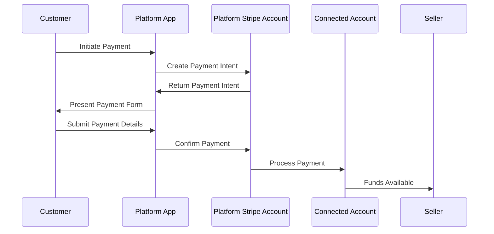
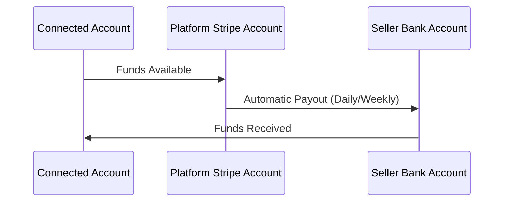
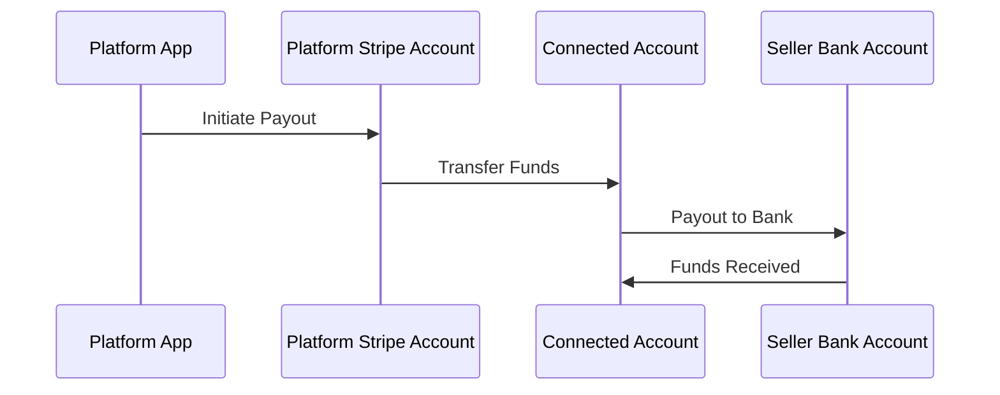

# Stripe Connect API Architecture

A comprehensive guide to understanding how Stripe Connect works and its architectural components.

## Table of Contents

- [Overview](#overview)
- [Architecture Components](#architecture-components)
- [Account Types](#account-types)
- [Payment Flow](#payment-flow)
- [Payout Flow](#payout-flow)
- [Integration Patterns](#integration-patterns)
- [Security & Compliance](#security--compliance)
- [API Endpoints](#api-endpoints)
- [Best Practices](#best-practices)
- [Getting Started](#getting-started)

## Overview

Stripe Connect is a platform that enables businesses to build marketplaces and platforms that facilitate payments between multiple parties. It allows you to:

- Onboard sellers/service providers as connected accounts
- Process payments on behalf of connected accounts
- Handle payouts to connected accounts
- Manage compliance and verification requirements
- Support multiple currencies and payment methods globally

## Architecture Components

### 1. Platform Application
Your web or mobile application that serves as the central hub for managing the marketplace.

**Responsibilities:**
- User management and authentication
- Connected account onboarding
- Payment processing orchestration
- Payout management
- Business logic and UI

### 2. Platform Stripe Account
The central Stripe account that orchestrates all operations.

**Key Features:**
- Manages connected accounts
- Processes payments on behalf of connected accounts
- Handles fee collection
- Manages payouts

### 3. Connected Accounts
Individual Stripe accounts representing your platform's users (sellers, service providers, etc.).

**Types:**
- **Standard Accounts**: User-managed with full dashboard access
- **Express Accounts**: Platform-managed with limited user access
- **Custom Accounts**: Fully platform-managed

### 4. Stripe Infrastructure
- **Payments API**: Processes transactions
- **Connect API**: Manages connected accounts
- **Payouts API**: Handles fund transfers
- **Webhooks**: Real-time event notifications

## Account Types

### Standard Accounts
```
┌─────────────────┐    ┌─────────────────┐
│   Platform      │    │   Connected     │
│   Account       │◄──►│   Account       │
│                 │    │   (Standard)    │
└─────────────────┘    └─────────────────┘
         │                       │
         │                       │
         ▼                       ▼
┌─────────────────┐    ┌─────────────────┐
│   Customer      │    │   Seller        │
│   Dashboard     │    │   Dashboard     │
└─────────────────┘    └─────────────────┘
```

**Characteristics:**
- User has full access to Stripe dashboard
- User manages their own settings and payouts
- Platform has limited control
- Best for: Established businesses with accounting needs

### Express Accounts
```
┌─────────────────┐    ┌─────────────────┐
│   Platform      │    │   Connected     │
│   Account       │◄──►│   Account       │
│                 │    │   (Express)     │
└─────────────────┘    └─────────────────┘
         │                       │
         │                       │
         ▼                       ▼
┌─────────────────┐    ┌─────────────────┐
│   Customer      │    │   Seller        │
│   Dashboard     │    │   Express UI    │
└─────────────────┘    └─────────────────┘
```

**Characteristics:**
- Platform manages most settings
- User has limited dashboard access
- Streamlined onboarding process
- Best for: Individual sellers, freelancers

### Custom Accounts
```
┌─────────────────┐    ┌─────────────────┐
│   Platform      │    │   Connected     │
│   Account       │◄──►│   Account       │
│                 │    │   (Custom)      │
└─────────────────┘    └─────────────────┘
         │                       │
         │                       │
         ▼                       ▼
┌─────────────────┐    ┌─────────────────┐
│   Customer      │    │   Seller        │
│   Dashboard     │    │   (No Access)   │
└─────────────────┘    └─────────────────┘
```

**Characteristics:**
- Fully platform-managed
- No user dashboard access
- Maximum control and customization
- Best for: White-label solutions

## Payment Flow

### 1. Customer Payment


### 2. Payment Processing Details

**Step-by-step process:**

1. **Payment Intent Creation**
   ```javascript
   const paymentIntent = await stripe.paymentIntents.create({
     amount: 2000, // $20.00
     currency: 'usd',
     application_fee_amount: 200, // $2.00 platform fee
     transfer_data: {
       destination: 'acct_1234567890', // Connected account
     },
   });
   ```

2. **Payment Confirmation**
   ```javascript
   const paymentIntent = await stripe.paymentIntents.confirm(
     'pi_1234567890',
     {
       payment_method: 'pm_1234567890',
     }
   );
   ```

3. **Fund Distribution**
   - Customer payment: $20.00
   - Platform fee: $2.00
   - Seller receives: $18.00
   - Stripe processing fee: ~$0.58 (2.9% + $0.30)

## Payout Flow

### 1. Automatic Payouts


### 2. Manual Payouts


### 3. Payout Management

**Platform-initiated payouts:**
```javascript
const transfer = await stripe.transfers.create({
  amount: 1800, // $18.00
  currency: 'usd',
  destination: 'acct_1234567890',
  transfer_group: 'ORDER_95',
});
```

**Connected account payouts:**
```javascript
const payout = await stripe.payouts.create({
  amount: 1800,
  currency: 'usd',
}, {
  stripeAccount: 'acct_1234567890',
});
```

## Integration Patterns

### 1. Embedded Checkout
```javascript
// Create checkout session
const session = await stripe.checkout.sessions.create({
  payment_method_types: ['card'],
  line_items: [{
    price_data: {
      currency: 'usd',
      product_data: {
        name: 'Product Name',
      },
      unit_amount: 2000,
    },
    quantity: 1,
  }],
  mode: 'payment',
  success_url: 'https://example.com/success',
  cancel_url: 'https://example.com/cancel',
  payment_intent_data: {
    application_fee_amount: 200,
    transfer_data: {
      destination: 'acct_1234567890',
    },
  },
});
```

### 2. Payment Element Integration
```javascript
// Create payment intent
const { client_secret } = await stripe.paymentIntents.create({
  amount: 2000,
  currency: 'usd',
  application_fee_amount: 200,
  transfer_data: {
    destination: 'acct_1234567890',
  },
});

// Initialize Payment Element
const elements = stripe.elements({ clientSecret });
const paymentElement = elements.create('payment');
```

### 3. Webhook Handling
```javascript
app.post('/webhook', express.raw({type: 'application/json'}), (req, res) => {
  const sig = req.headers['stripe-signature'];
  let event;

  try {
    event = stripe.webhooks.constructEvent(req.body, sig, endpointSecret);
  } catch (err) {
    console.log(`Webhook signature verification failed.`, err.message);
    return res.status(400).send(`Webhook Error: ${err.message}`);
  }

  // Handle the event
  switch (event.type) {
    case 'payment_intent.succeeded':
      const paymentIntent = event.data.object;
      // Handle successful payment
      break;
    case 'account.updated':
      const account = event.data.object;
      // Handle account updates
      break;
    default:
      console.log(`Unhandled event type ${event.type}`);
  }

  res.json({received: true});
});
```

## Security & Compliance

### 1. PCI Compliance
- Stripe handles PCI compliance for payment data
- Use Stripe.js for secure payment form handling
- Never store sensitive payment information

### 2. KYC/AML Requirements
- Stripe handles identity verification
- Collect required information during onboarding
- Monitor for suspicious activity

### 3. Data Protection
- Encrypt sensitive data in transit and at rest
- Implement proper access controls
- Regular security audits

### 4. Webhook Security
```javascript
const crypto = require('crypto');

function verifyWebhookSignature(payload, signature, secret) {
  const elements = signature.split(',');
  const signatureHash = elements[1];
  const expectedHash = crypto
    .createHmac('sha256', secret)
    .update(payload)
    .digest('hex');
  
  return crypto.timingSafeEqual(
    Buffer.from(signatureHash, 'hex'),
    Buffer.from(expectedHash, 'hex')
  );
}
```

## API Endpoints

### Core Connect Endpoints

| Endpoint | Method | Description |
|----------|--------|-------------|
| `/v1/accounts` | POST | Create connected account |
| `/v1/accounts/{id}` | GET | Retrieve account details |
| `/v1/accounts/{id}` | POST | Update account |
| `/v1/accounts/{id}/login_links` | POST | Create login link |
| `/v1/transfers` | POST | Create transfer |
| `/v1/transfers/{id}` | GET | Retrieve transfer |
| `/v1/payouts` | POST | Create payout |
| `/v1/payouts/{id}` | GET | Retrieve payout |

### Account Onboarding

```javascript
// Create Express account
const account = await stripe.accounts.create({
  type: 'express',
  country: 'US',
  email: 'seller@example.com',
  capabilities: {
    card_payments: {requested: true},
    transfers: {requested: true},
  },
});

// Create account link for onboarding
const accountLink = await stripe.accountLinks.create({
  account: account.id,
  refresh_url: 'https://example.com/reauth',
  return_url: 'https://example.com/return',
  type: 'account_onboarding',
});
```

## Best Practices

### 1. Error Handling
```javascript
try {
  const paymentIntent = await stripe.paymentIntents.create({
    // ... payment details
  });
} catch (error) {
  if (error.type === 'StripeCardError') {
    // Card was declined
    console.log('Card declined:', error.message);
  } else if (error.type === 'RateLimitError') {
    // Too many requests
    console.log('Rate limit exceeded');
  } else {
    // Other error
    console.log('Error:', error.message);
  }
}
```

### 2. Idempotency
```javascript
const paymentIntent = await stripe.paymentIntents.create({
  amount: 2000,
  currency: 'usd',
  // ... other parameters
}, {
  idempotencyKey: 'unique-key-' + Date.now(),
});
```

### 3. Testing
- Use Stripe test mode for development
- Test with various card numbers and scenarios
- Implement comprehensive webhook testing
- Use Stripe CLI for local webhook testing

### 4. Monitoring
- Set up webhook monitoring
- Track payment success rates
- Monitor account status changes
- Implement proper logging

## Getting Started

### 1. Prerequisites
- Stripe account with Connect enabled
- Node.js and npm installed
- Basic understanding of REST APIs

### 2. Installation
```bash
npm install stripe
```

### 3. Environment Setup
```bash
# .env
STRIPE_SECRET_KEY=sk_test_...
STRIPE_PUBLISHABLE_KEY=pk_test_...
STRIPE_WEBHOOK_SECRET=whsec_...
STRIPE_ENVIRONMENT=sandbox
```

### 4. Basic Implementation
```javascript
const stripe = require('stripe')(process.env.STRIPE_SECRET_KEY);

// Create connected account
const account = await stripe.accounts.create({
  type: 'express',
  country: 'US',
  email: 'seller@example.com',
});

console.log('Connected account created:', account.id);
```

### 5. Next Steps
1. Implement account onboarding flow
2. Set up payment processing
3. Configure webhooks
4. Implement payout management
5. Add error handling and monitoring

## Resources

- [Stripe Connect Documentation](https://stripe.com/docs/connect)
- [Connect API Reference](https://stripe.com/docs/api/connect)
- [Webhook Events](https://stripe.com/docs/api/events/types)
- [Testing Guide](https://stripe.com/docs/connect/testing)
- [Best Practices](https://stripe.com/docs/connect/best-practices)

## Support

For technical support and questions:
- [Stripe Support](https://support.stripe.com/)
- [Developer Community](https://github.com/stripe/stripe-node)
- [Stack Overflow](https://stackoverflow.com/questions/tagged/stripe-payments)
